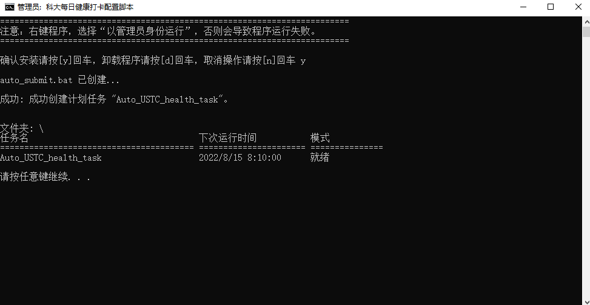
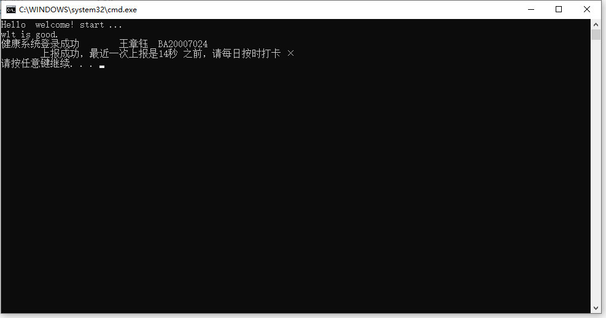
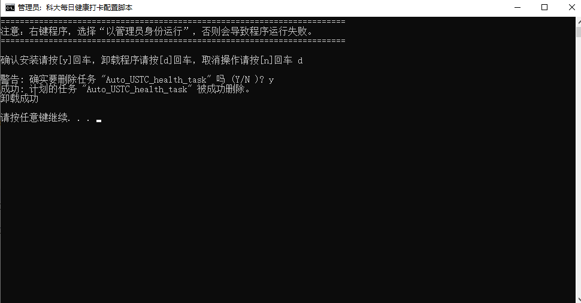

# Python自动健康打卡脚本说明

>功能：自动登录网络通，自动健康打卡
>參考https://github.com/windshadow233/USTC-Auto-Health-Report

* 环境： python3
* 安装库： json，bs4，lxml，requests，subprocess

## 第一步：python打卡程序
* 注意：该文件夹所在路径不要包含中文
* 需要修改程序的配置文件user_info.json：
 
	> wlt_user: 网络通账号
	> wlt_pwd:  网络通密码
	> "0": ["BA20007024" ,"passwd", "user_name"],    健康打卡系统账户密码
	> "1": ["BA20007024" ,"passwd", "user_name"]     可以追加，替别人打卡
* 脚本执行时间默认早上8点10，可以在USTC_health_daka.bat中修改
	第30行： set set_time=08:10

## 第二步：windows定时启动打卡程序
* Windows系统
* 右键以管理员身份运行USTC_health_daka.bat

* 程序每日上午8点10分自动运行

* 删除定时任务

* Linux系统，参考crontab命令